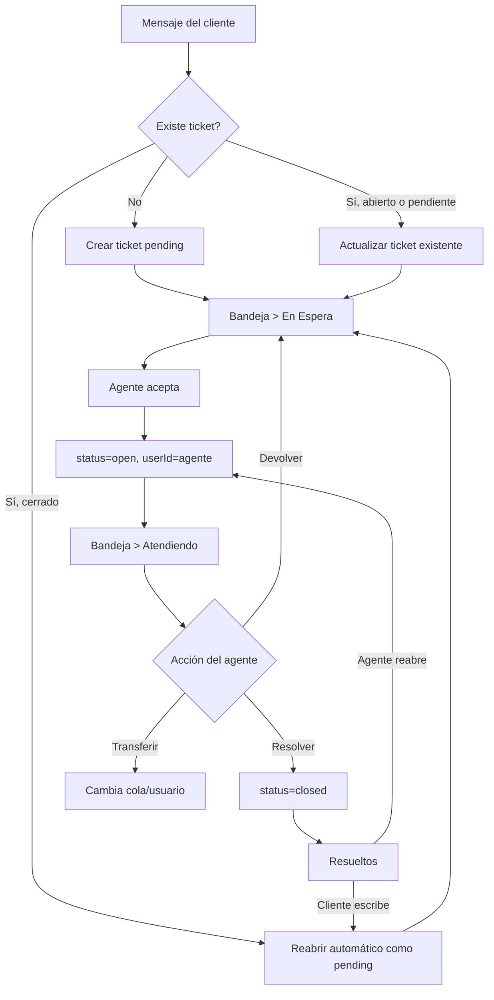

# Funcionamiento de la bandeja de entrada y tickets

Este documento resume cómo funciona la bandeja de chats/tickets en esta versión de WhaTicket para poder usarlo como referencia al adaptar WACRM.

## Conceptos principales

La bandeja trabaja con tres estados principales de ticket:

- `pending`: ticket en espera. Es un chat que ha llegado a la bandeja principal pero todavía no está siendo atendido por ningún agente.
- `open`: ticket atendiendo. Es un chat aceptado/asignado a un agente.
- `closed`: ticket resuelto. Es una conversación cerrada que queda en la pestaña de resueltos.

En la interfaz estos estados se ven así:

- `Bandeja`: pestaña principal de trabajo.
- `Atendiendo`: subpestaña dentro de Bandeja para tickets `open`.
- `En Espera`: subpestaña dentro de Bandeja para tickets `pending`.
- `Resueltos`: pestaña para tickets `closed`.
- `Buscar`: pestaña de búsqueda general.

## Entrada de tickets nuevos

Cuando llega un mensaje nuevo desde WhatsApp, el backend busca si ya existe un ticket para ese contacto y esa línea de WhatsApp.

El flujo es:

1. Si existe un ticket reciente/activo para el mismo contacto, se reutiliza.
2. Si el ticket existente estaba `closed`, se reabre automáticamente como `pending`, salvo que el flujo haya pedido conservarlo cerrado.
3. Si no existe ticket, se crea uno nuevo con estado `pending`.
4. El ticket se asigna al departamento/cola por defecto de esa línea de WhatsApp si todavía no tiene cola.
5. Se actualiza el contador de mensajes no leídos.

Resultado funcional: los mensajes entrantes del cliente aparecen primero en `Bandeja > En Espera`, no directamente en `Atendiendo`.

Referencia técnica:

- `backend/src/services/TicketServices/FindOrCreateTicketService.ts`
- `backend/src/services/MessageServices/ListMessagesService.ts`
- `backend/src/controllers/MessageController.ts`

## Separación entre En Espera y Atendiendo

La separación se basa exclusivamente en el campo `status` del ticket.

`pending` significa que el chat está esperando aceptación. En la lista se muestra con botón `ACEPTAR` y no se abre directamente al hacer clic sobre la fila. También puede verse una vista previa del chat.

`open` significa que el chat está atendido por un agente. Se puede abrir, responder, transferir, devolver o resolver.

En la interfaz:

- `Bandeja > Atendiendo` carga tickets con `status=open`.
- `Bandeja > En Espera` carga tickets con `status=pending`.
- Cada subpestaña tiene su contador.
- La lista se ordena por `updatedAt DESC`, por lo que lo más reciente aparece arriba.

Referencia técnica:

- `frontend/src/components/TicketsManager/index.jsx`
- `frontend/src/components/TicketsList/index.jsx`
- `frontend/src/components/TicketListItem/index.jsx`
- `backend/src/services/TicketServices/ListTicketsService.ts`

## Aceptar un ticket de la bandeja principal

Aceptar un ticket significa cambiarlo de `pending` a `open` y asignarlo al agente que lo acepta.

El agente puede aceptar desde:

- El botón lateral `ACEPTAR` en la fila del ticket pendiente.
- El botón `Aceptar` dentro de la vista previa o cabecera de acciones.

Cuando se acepta:

1. El frontend hace `PUT /tickets/:ticketId` con `status: "open"` y `userId` del agente.
2. El backend cambia el ticket a `open`.
3. Si el ticket venía de `pending` y no se envió un usuario explícito, se asigna automáticamente al usuario que hace la petición, excepto si es admin.
4. Se crea un mensaje interno de tipo notificación: `_Chat aceptado por ..._`.
5. Se emiten eventos en tiempo real para quitar el ticket de `pending` y actualizarlo en `open`.
6. La interfaz navega al chat aceptado y fuerza la vista de `Bandeja > Atendiendo`.

Si está activado el ajuste `ticketLockByAgent`, el backend evita que dos agentes acepten el mismo ticket a la vez. En caso de conflicto, responde con un error indicando que el chat está siendo atendido por otro usuario.

Referencia técnica:

- `frontend/src/components/TicketListItem/index.jsx`
- `frontend/src/components/TicketActionButtons/index.jsx`
- `backend/src/services/TicketServices/UpdateTicketService.ts`
- `backend/src/helpers/CheckTicketLockedByOtherUser.ts`

## Filtros de Míos y Todos

La bandeja tiene un botón compacto para alternar entre:

- `Míos`: muestra los tickets asignados al usuario actual y los tickets pendientes de sus departamentos.
- `Todos`: muestra todos los tickets de los departamentos permitidos para el usuario.

El comportamiento real se controla con el parámetro `showAll`.

Sin `showAll=true`, el backend aplica:

- tickets cuyo `userId` es el usuario actual;
- o tickets con `status=pending`;
- y siempre limitados a las colas/departamentos permitidos.

Con `showAll=true`, el backend muestra todos los tickets de las colas seleccionadas, sin filtrar por usuario asignado.

Importante: aunque el usuario active `Todos`, el backend sigue limitando los resultados a las colas/departamentos a los que pertenece el usuario. Si se pasan `queueIds`, se cruzan con las colas reales permitidas del usuario.

Referencia técnica:

- `frontend/src/components/TicketsManager/index.jsx`
- `frontend/src/components/TicketsQueueSelect/index.jsx`
- `backend/src/services/TicketServices/ListTicketsService.ts`

## Filtro por departamentos/colas

La bandeja permite filtrar por departamentos. Internamente se envía `queueIds` al backend.

El backend no acepta cualquier cola enviada desde el frontend: primero carga las colas asociadas al usuario y solo permite las que coinciden.

Si el usuario no tiene colas permitidas, la lista devuelve vacío.

Este filtro se aplica en:

- `Bandeja > Atendiendo`
- `Bandeja > En Espera`
- `Resueltos`
- `Buscar`

## Búsquedas

Hay varias búsquedas:

- En `Bandeja`, el campo "Buscar en bandeja" busca en tickets `open,pending`.
- En `Resueltos`, el campo busca sobre tickets `closed`.
- En `Buscar`, se puede hacer una búsqueda general.

La búsqueda compara:

- nombre del contacto;
- número del contacto;
- cuerpo de mensajes relacionados.

El frontend espera 500 ms antes de aplicar el término de búsqueda para no consultar en cada tecla.

Referencia técnica:

- `frontend/src/components/TicketsManager/index.jsx`
- `backend/src/services/TicketServices/ListTicketsService.ts`

## Cerrar o resolver una conversación

Resolver una conversación significa cambiar el ticket de `open` a `closed`.

Desde la cabecera del chat, el agente pulsa `Resolver`.

El flujo es:

1. El frontend envía `PUT /tickets/:ticketId` con `status: "closed"`.
2. El backend comprueba que el ticket tenga línea de WhatsApp asignada.
3. Se actualiza el estado a `closed`.
4. Se crea una notificación interna: `_Chat resuelto por ..._`.
5. Si la línea de WhatsApp tiene `farewellMessage`, se envía ese mensaje de despedida al cliente.
6. El ticket sale de `Atendiendo` y pasa a `Resueltos`.
7. La interfaz vuelve a `/tickets`.

Un ticket pendiente también puede resolverse desde la vista previa si se permite `allowResolvePending`, aunque el flujo principal normal es aceptar y luego resolver.

Referencia técnica:

- `frontend/src/components/TicketActionButtons/index.jsx`
- `backend/src/controllers/TicketController.ts`
- `backend/src/services/TicketServices/UpdateTicketService.ts`

## Devolver un ticket a En Espera

Un ticket `open` puede devolverse a la bandeja de espera con el botón `Devolver`.

Esto cambia el estado de `open` a `pending`. Si no hay cambio de departamento, el backend crea una notificación interna:

`_Chat devuelto por ..._`

Funcionalmente, esto sirve para soltar un chat que estaba siendo atendido y dejarlo disponible para que otro agente lo acepte.

Referencia técnica:

- `frontend/src/components/TicketActionButtons/index.jsx`
- `backend/src/services/TicketServices/UpdateTicketService.ts`

## Reabrir una conversación cerrada

Hay dos formas de reapertura.

### Reapertura manual por agente

En un ticket `closed`, el agente puede pulsar `Reabrir`.

El flujo cambia el ticket de `closed` a `open` y lo asigna al agente actual. El backend crea una notificación interna:

`_Chat reabierto por ..._`

Después la interfaz navega al chat reabierto.

### Reapertura automática por mensaje del cliente

Cuando llega un mensaje nuevo del cliente para un contacto cuyo último ticket estaba `closed`, el backend lo vuelve a poner en `pending`, limpia `userId` y `queueId`, y después vuelve a aplicar la cola por defecto de la línea si corresponde.

Resultado funcional:

- el cliente escribe;
- el chat cerrado reaparece en `Bandeja > En Espera`;
- queda sin agente asignado;
- un agente debe aceptarlo de nuevo.

Referencia técnica:

- `backend/src/services/TicketServices/FindOrCreateTicketService.ts`
- `backend/src/services/TicketServices/UpdateTicketService.ts`

## Transferir conversación

Desde las opciones del ticket se puede transferir a otro departamento/cola o usuario.

Cuando cambia la cola, el backend crea una notificación interna:

`_Chat transferido por ... a ..._`

En la vista previa de un ticket `pending`, existe también opción de transferir sin seleccionar usuario y usando usuario comodín, útil para mover tickets entre departamentos antes de aceptarlos.

Referencia técnica:

- `frontend/src/components/TransferTicketModal/index.jsx`
- `frontend/src/components/TicketOptionsMenu/index.jsx`
- `backend/src/services/TicketServices/UpdateTicketService.ts`

## Ventana de 24 horas de WhatsApp Cloud API

La ventana de 24 horas solo aplica a líneas configuradas con proveedor `cloud`. Para proveedores no Cloud API, el sistema considera que se puede enviar mensaje libremente.

El backend calcula la ventana buscando el último mensaje entrante del cliente (`fromMe=false`) dentro del ticket.

Reglas:

- Si la línea no es Cloud API: se puede escribir libremente.
- Si es Cloud API y existe un mensaje entrante reciente: se puede escribir hasta `lastInboundMessageAt + windowHours`.
- Por defecto `windowHours` es 24.
- Se puede cambiar con la variable `WHATSAPP_CLOUD_CUSTOMER_CARE_WINDOW_HOURS`.
- Si no hay mensaje entrante o la ventana expiró, no se permite enviar texto libre ni adjuntos.
- Fuera de ventana, se debe usar una plantilla aprobada de WhatsApp.

En la interfaz:

- En la cabecera/contacto se muestra algo como `Disponible hasta DD/MM HH:mm` o `Ventana cerrada`.
- En el cajón de contacto se muestra un aviso más detallado.
- En el input, si la ventana está cerrada, aparece una alerta: "Ventana de 24h cerrada. Solo puedes iniciar conversación con una plantilla aprobada."
- El campo de texto, emojis, adjuntos y audio quedan deshabilitados fuera de ventana.
- El menú permite `Enviar plantilla`.

En el backend:

- `SendWhatsAppMessage` y `SendWhatsAppMedia` validan la ventana antes de enviar.
- `SendWhatsAppTemplate` permite enviar plantillas aprobadas.
- El endpoint `/messages/:ticketId/customer-care-window` devuelve el estado de la ventana.
- El endpoint `/messages/:ticketId/templates` lista plantillas aprobadas para la línea.
- El endpoint `/messages/:ticketId/template` envía una plantilla.

Referencia técnica:

- `backend/src/helpers/GetCloudApiCustomerCareWindow.ts`
- `backend/src/helpers/AssertCloudApiCustomerCareWindow.ts`
- `backend/src/controllers/MessageController.ts`
- `backend/src/services/WbotServices/SendWhatsAppMessage.ts`
- `backend/src/services/WbotServices/SendWhatsAppMedia.ts`
- `backend/src/services/WbotServices/SendWhatsAppTemplate.ts`
- `frontend/src/components/Ticket/index.jsx`
- `frontend/src/components/ContactDrawer/index.jsx`
- `frontend/src/components/MessageInput/index.jsx`

## Tiempo real y actualización de listas

La bandeja usa sockets para mantener la lista actualizada.

Canales/eventos principales:

- Las listas se unen por estado con `joinTickets`, por ejemplo `open`, `pending` o `closed`.
- El chat abierto se une con `joinChatBox`.
- Las notificaciones generales usan `joinNotification`.

Eventos usados:

- `ticket` con `action=update`: actualiza o inserta un ticket.
- `ticket` con `action=delete`: elimina el ticket de una lista cuando cambió de estado o fue borrado.
- `appMessage` con `action=create`: actualiza mensajes no leídos y sube el ticket arriba.
- `contact` con `action=update`: actualiza los datos del contacto en la lista.

Cuando un ticket cambia de estado, el backend emite un `delete` al estado anterior y un `update` al estado nuevo. Por eso, al aceptar un `pending`, desaparece de `En Espera` y aparece en `Atendiendo`.

Referencia técnica:

- `frontend/src/components/TicketsList/index.jsx`
- `frontend/src/components/Ticket/index.jsx`
- `backend/src/services/TicketServices/UpdateTicketService.ts`
- `backend/src/libs/socket.ts`

## Resumen del ciclo de vida

## Equivalencias recomendadas para adaptar WACRM

Para adaptar este flujo en WACRM, conviene mapear estas piezas:

| WhaTicket | Significado funcional | Equivalente a buscar/crear en WACRM |
| --- | --- | --- |
| `Ticket.status=pending` | Chat entrante esperando agente | Bandeja principal / sin asignar |
| `Ticket.status=open` | Chat en atención | Conversación asignada a agente |
| `Ticket.status=closed` | Chat resuelto | Conversación cerrada/resuelta |
| `Ticket.userId` | Agente asignado | Owner/assignee |
| `Ticket.queueId` | Departamento/cola | Equipo, cola o departamento |
| `unreadMessages` | Contador no leído | Badge de mensajes pendientes |
| `showAll` | Ver todos vs mis chats | Filtro global/mis conversaciones |
| `customerCareWindow` | Ventana WhatsApp Cloud API | Permiso de respuesta libre vs plantilla |
| `ticketLockByAgent` | Bloqueo por agente | Evitar doble atención concurrente |

Puntos clave que WACRM debería replicar:

1. Todo mensaje entrante nuevo debe entrar como `pending` si no hay conversación activa asignada.
2. Aceptar debe cambiar a `open` y asignar el agente actual.
3. Resolver debe cambiar a `closed`.
4. Si el cliente escribe sobre una conversación cerrada, debe volver a `pending`, no a `open`.
5. El filtro "Míos" debe mostrar los chats del agente y los pendientes de sus colas.
6. El filtro "Todos" debe respetar permisos de cola/departamento.
7. Fuera de la ventana de 24h de Cloud API, se debe bloquear texto libre y permitir solo plantillas aprobadas.
8. El sistema debe emitir eventos en tiempo real al cambiar estado para mover el ticket entre listas.

## Endpoints importantes

- `GET /tickets`: lista tickets con filtros `status`, `showAll`, `queueIds`, `searchParam`, `pageNumber`.
- `GET /tickets/:ticketId`: abre un ticket por `publicId` o id.
- `PUT /tickets/:ticketId`: cambia estado, usuario, cola o línea.
- `POST /tickets`: crea ticket manual.
- `POST /tickets/open-or-create`: abre o crea ticket manual desde contacto/número.
- `GET /messages/:ticketId`: lista mensajes y marca como leído si no es preview.
- `POST /messages/:ticketId`: envía texto o media.
- `GET /messages/:ticketId/customer-care-window`: consulta ventana de 24h.
- `GET /messages/:ticketId/templates`: lista plantillas aprobadas.
- `POST /messages/:ticketId/template`: envía plantilla aprobada.

## Archivos principales del flujo

- `backend/src/services/TicketServices/FindOrCreateTicketService.ts`
- `backend/src/services/TicketServices/ListTicketsService.ts`
- `backend/src/services/TicketServices/UpdateTicketService.ts`
- `backend/src/controllers/TicketController.ts`
- `backend/src/controllers/MessageController.ts`
- `backend/src/helpers/GetCloudApiCustomerCareWindow.ts`
- `backend/src/helpers/AssertCloudApiCustomerCareWindow.ts`
- `frontend/src/components/TicketsManager/index.jsx`
- `frontend/src/components/TicketsList/index.jsx`
- `frontend/src/components/TicketListItem/index.jsx`
- `frontend/src/components/TicketActionButtons/index.jsx`
- `frontend/src/components/Ticket/index.jsx`
- `frontend/src/components/MessageInput/index.jsx`
